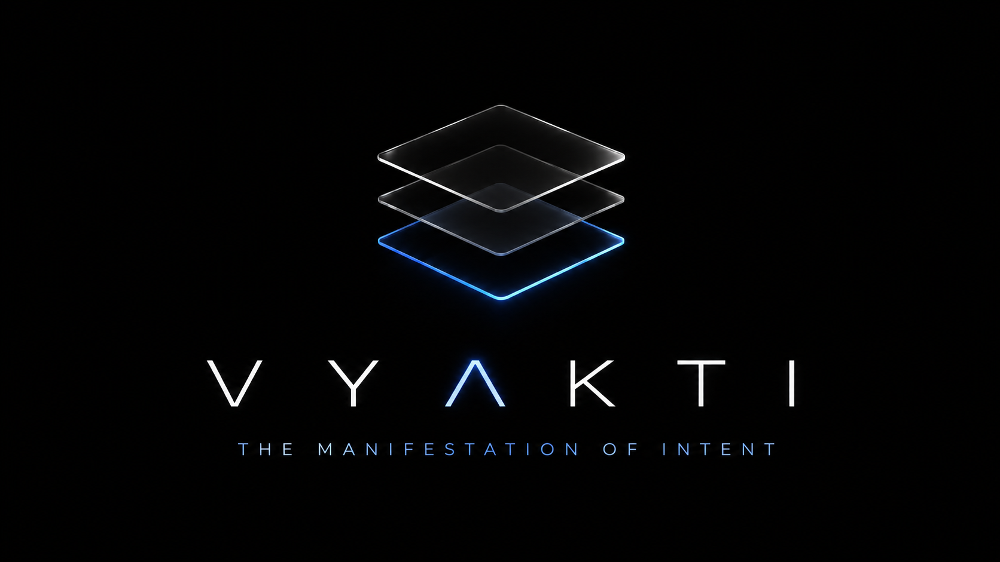
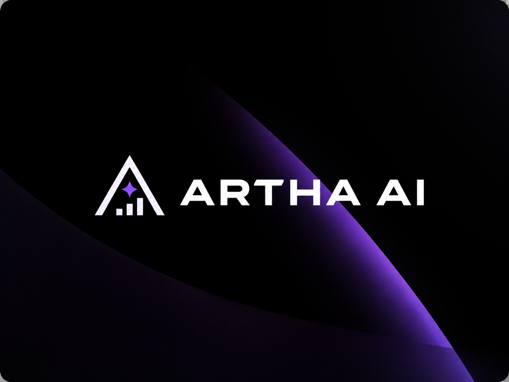
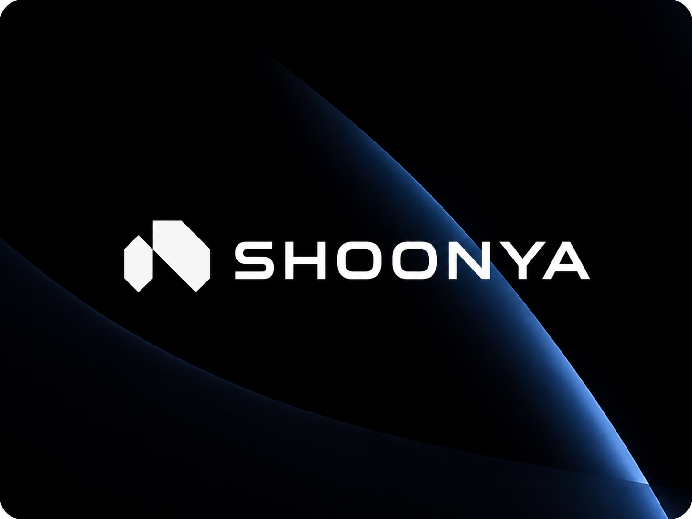

  

   
  I am a <b>final year Information Technology student</b> passionate about building <b>Enterprise AI Systems</b>, <b>Agentic Workflows</b>, and secure AI infrastructure. My work focuses on designing reliable, production-ready applications that combine LLMs, automation, RAG, and intelligent orchestration to solve real business problems.

   
  
  
  

---

### 🛠️ The Engineering Arsenal

| **Programming & Core** | **AI & Data Infrastructure** | **Frameworks & DevOps** |
| :--- | :--- | :--- |
|     |       |       |

---

## 🏆 Featured Projects

<table>
<tr>

<a href="https://github.com/vedthombre/vyakti-ai">
<td width="55%" valign="middle">

</td>
</a>

<td width="45%">

### 🛒 Vyakti AI

**Voice-First Agentic Commerce Platform**

An ultra-low-latency commerce engine designed to understand user intent and orchestrate intelligent shopping workflows through conversational AI.

**Tech Stack**

`Next.js` `TypeScript` `LLMs` `MCP` `OAuth 2.1` `Agentic AI`

</td>
</tr>
</table>

 

<table>
<tr>

<a href="https://github.com/vedthombre/artha-financial-ai-intelligence">
<td width="55%" valign="middle">

</td>
</a>

<td width="45%">

### 🤖 Artha AI

**Autonomous Financial Intelligence**

A financial intelligence system combining RAG, self-correction workflows, hybrid search, and LLM reasoning to produce reliable market insights while reducing hallucinations.

**Tech Stack**

`LangGraph` `RAG` `ChromaDB` `Llama 3.3` `Groq`

</td>
</tr>
</table>

 

<table>
<tr>

<a href="https://github.com/vedthombre/Shoonya">
<td width="55%" valign="middle">

</td>
</a>

<td width="45%">

### 🔒 Shoonya

**AI Security & Privacy Platform**

A privacy-first security platform that detects and prevents sensitive-data leaks across AI tools and developer environments using a hybrid ML pipeline.

**Tech Stack**

`JavaScript` `Security` `Machine Learning` `Regex` `Chrome Extension`

</td>
</tr>
</table>

---

### 📊 Data & Activity Flow

  

  

 

  
  

---

### 🎹 Offline Mode

> *"Logic is the beginning of wisdom, not the end."* — Spock

When I'm not designing AI systems or building automation pipelines, I am:

* 🎹 Playing the **Piano** (Trinity College London).
* 🌍 Exploring new places & travelling.
* 📚 Reading about **Enterprise AI**, **AI Security**, **Distributed Systems**, and **Cloud Architecture**.

   
  

